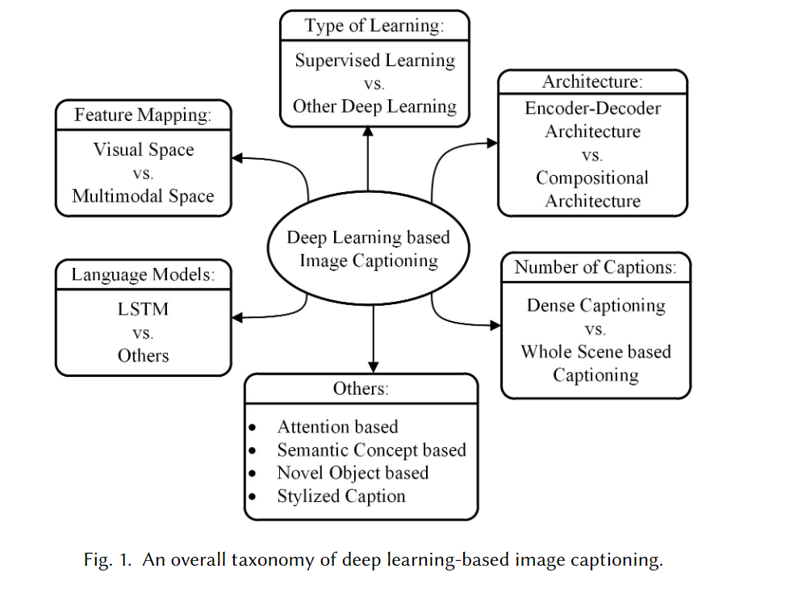
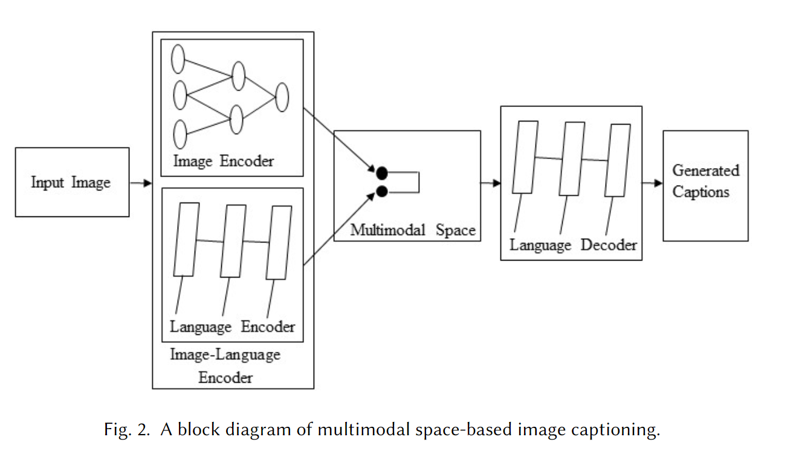

# image caption笔记

### 基于模板的image caption方法

> 模板是预定义的且该方法只能生成固定长度的图像标题

### 基于检索的image caption方法（retrieval-based）

>在基于检索的方法中，字幕是从一组现有的字幕中检索出来的。基于检索的方法首先从训练数据集中找到具有标题的视觉相似的图像。这些标题称为候选标题。查询图像的标题是从这些标题池中选择的

>缺点是：只能生成语法正确的标题，不能生成语义正确的标题

### novel标题

> 这一类别的一般方法是首先分析图像的视觉内容，然后使用语言模型从视觉内容生成图像标题。

> 这类方法大多使用深度学习的方法，效果比先前的好

#### 图1描述了基于深度学习的图像字幕方法的总体分类。

> 该图说明了不同类别的图像字幕方法的比较。基于图像字幕生成的图像字幕方法多采用视觉空间和基于深度机器学习的技术。字幕也可以从多模式空间生成。 基于深度学习的图像字幕方法也可以归类为以下学习技术：监督学习，强化学习和无监督学习。

### Visual Space vs. Multimodal Space

> 在基于视觉空间的方法中，图像特征和相应的字幕独立地传递给语言解码器。相比之下，在多模态空间中，共享多模态空间是从图像和相应的标题文本中学习的。然后将这个多模态表示传递给语言解码器。

#### 多模态空间

> 典型的多模态空间方法的体系结构包括语言编码器部分、视觉部分、多模态空间部分和语言解码器部分

> 视觉部分使用深度卷积神经网络作为特征提取器来提取图像特征。 语言编码器部分提取单词特征，并为每个单词学习密集的特征嵌入。 然后将语义时态上下文转发到递归层。多模态空间部分将图像特征映射到带有词特征的公共空间。然后，生成的映射被传递给语言解码器，后者通过解码映射生成标题。

>此类方法包括以下步骤：
>
>（1）使用深度神经网络和多模态神经语言模型在多模态空间中共同学习图像和文本。
>
>（2）语言生成部分使用步骤1中的信息生成字幕。

​												基于空间的多模态图像字幕方法的总图如图2所示。

> Kiros et al. [69].的工作利用CNN提取图像特征，生成图像标题。它使用一个多模态空间来联合表示图像和文本，用于多模态表示学习和图像字幕生成。介绍了多模态神经语言模型。
>
> 与大多数以前的方法不同，此方法不依赖任何其他模板，结构或约束。 相反，它取决于分别从深度神经网络和多模式神经语言模型中学到的高级图像特征和单词表示。 神经语言模型有局限性，无法处理大量数据，并且无法有效地长期存储[64]。
>
> Kiros等。 [70]扩展了他们在[69]中的工作，学习了联合图像句子嵌入，其中LSTM用于句子编码，而新的神经语言模型称为**结构内容神经语言模型（****SC-NLM）用于图像字幕生成**。与现有方法相比，SC-NLM具有一个优点，即它**可以将句子的结构提取到编码器生成的内容中**。与[69]提出的方法相比，它还可以帮助他们在生成逼真的图像标题方面取得重大改进。

##### Mao等人[94]提出了一种多模态递归神经网络(m-RNN)方法

> 该方法有两个子网：用于语句的深度递归神经网络和用于图像的深度卷积网络。 这两个子网在多模式层中相互交互以形成整个m-RNN模型。 图像和句子片段都作为此方法的输入。 它计算概率分布以生成字幕的下一个单词。